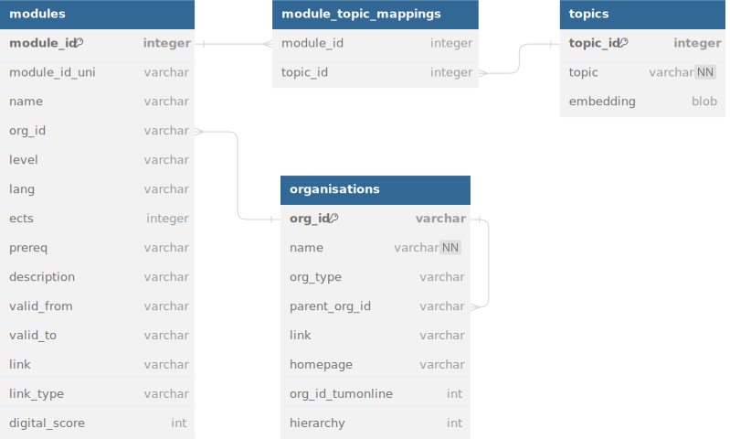

# Implementation Notes

## Setup Steps

1. Clean Database / Setup new Database
2. Scrape Organisations
3. Compute Topic Embeddings

## Top Level Overview

1. Extraction of Student Input
2. Filter modules based on student input
    - [x] School
    - [] Previous Courses
    - [x] Language Preference
    - [x] Study Level
3. Rank Modules based on prerequisites and topics
    - [] Topics
        - [x] Topics of interest
        - [] Excluded Topics
    - [] Course Prerequisites
4.
4. Output modules in an appealing format

----------------

## Database

### Old Database

- Path: `resources/modules_old.db`
- Database consisting of **9 columns**:
    - SCRAPED_MODULES(_NEW):
        - Modules, that were scraped from TUMonline

### Creation of new Database

- Path `/resources/modules.db`

#### Mapping of tables of old DB to new DB

- SCORED_MODULES_NEW → modules
- NERD_MODULES_NEW → topics
- NERD_MODULES_NEW → module_topic_mappings

#### Scraping new table

- organisations:
    - Contains university, schools, departments, chairs, institutes etc.
    - **Function**: Selecting topics / modules by school

#### Schema

---

##            