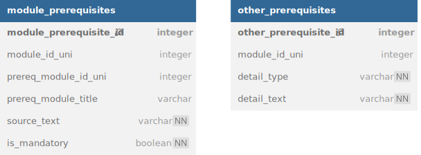

# Implementation Notes

## Setup Steps

1. Clean Database / Setup new Database
2. Scrape Organisations
3. Compute Topic Embeddings

## Top Level Overview

1. Extraction of Student Input
2. Filter modules based on student input
    - [x] School: Selector
    - [] Previous Courses: List selector (with search field)
    - [x] ECTS: Selector (range from 1 to 30) 
    - [x] Language Preference: Selector (English, German, Other)
    - [x] Study Level: Selector (Bachelor, Master, Other)
    - - [] Topics
        - [x] Topics of interest: Text Field
        - [] Excluded Topics: Text Field
3. Rank Modules based on prerequisites and topics
    - [] Course Prerequisites
    - [] Digitalisierungsgrad
    - Similarity score anzeigen (topic überschneidung)
4.
4. Output modules in an appealing format

----------------

## Database

### Old Database

- Path: `resources/modules_old.db`
- Database consisting of **9 columns**:
    - SCRAPED_MODULES(_NEW):
        - Modules, that were scraped from TUMonline

### Creation of new Database

- Path `/resources/modules.db`

#### Mapping of tables of old DB to new DB

- SCORED_MODULES_NEW → modules
- NERD_MODULES_NEW → topics
- NERD_MODULES_NEW → module_topic_mappings

#### Scraping new table

- organisations:
    - Contains university, schools, departments, chairs, institutes etc.
    - **Function**: Selecting topics / modules by school

#### Schema

---

## Topic Mapping
In order to recommend modules based on the topics the topics that were given by the student have to be mapped to topics in the database.

### Similarity Search
This can be done by computing embeddings of all the existing topics. When mapping to a topic we will find the nearest topic by using knn-search.

## Prerequisite Mapping

In order to filter / rank based on module prerequisites we need to bring the prerequisites in a structured format.
Currently the prerequisites are found in an unstructured format, to be precise: Natural Language. In these texts the
course organisers specify knowledge the students should have attained before enrolling in the course.
Such knowledge could be:

- Successful participation in other courses that teach topics that are essential in order to successfully take the
  module
- Skills the student should bring such as "programming knowledge in C"
- Other information that is important but that doesn't fit in the previous two categories: "Wilingness to give a 20
  minute presentation"
  Sometimes previous participation in a course is mandatory to enroll in the module of interest. Sometimes it is just
  recommended.

The next section will discuss the ways on how to bring the unstructured prerequisites into a structured format.

### Definition of the schema

In the last section we identified three different datapoints:

1. Module Prerequisites: In the text the organisers mention either the module ID or the module title or both. Also they
   mention whether successful participation is mandatory or recommended
2. Skill Prerequisites: THe second prerequisite would be skills. These cannot be specified any more narrow. They can
   range from progtamming skills to Basic Knowledge in a given topic
3. Other Prerequisites: These include all the prerequisites that don't fall in the previous 2. One example would be:
   Wilingness to give a 20
   minute presentation

The final schema can be then defined in the following way:

### Validation of the extracted Prerequisites

Before we start with the extraction in an automated way we need to be able to confirm that the extracted prerequisites are accurate.
This we can do by manually formatting the prerequisites. The manually formatted prerequisites will define our test set. 
This test set can be leveraged to improve and validate our automated prerequisite system.
We will draw n module prerequisites out of the module table that was put in a random order. Then we label the text in the set manually.

- Prodigy Researchers License
- Label random 10% of dataset (700 prereq tests)
- String Similarity Metrics for computing similarity for the titles (Levensthtein vs fuzzy search)
- 

#### Example 
> MA3301 Numerics of Differential Equations, MA3001 Functional Analysis, programming skills (e.g. MATLAB)
>
> -- <cite>[Numerical Approximation Theory, MA4305](https://campus.tum.de/tumonline/wbModHb.wbShowMHBReadOnly?pKnotenNr=769580)</cite>
- [Numerical Approximation Theory, MA4305](https://campus.tum.de/tumonline/wbModHb.wbShowMHBReadOnly?pKnotenNr=769580)
- Skills: [programming skills (e.g. MATLAB)]
- Other: []

### Extraction Methods

### Regex extraction

Because the Module IDs are presented in a structured way we can easily find them with the help of regular expressions.
Examples for modules:
WZ6407
MA2504
PH9101
CH1020

Two upper case characters followed by 4 digits.

We can define a regex that matches only these ids:
'[A-Z]{2}[0-9]{4}

If the module id is specified as a prerequisite then it will be easy to link to the module.
If there is only the module title provided it is hard to find it.

Only using this method is not sufficient because only **900 out of 7000 modules**  where prerequisites are specified contain module_ids. 
That means we can use this in addition to a different extraction tool.

#### LLM extraction with function calling
That's where we need a LLM to help us find module titles in the prerequisite text.
Also it can try to find more information such as whether the course is mandatory or recommended.

Not only course info can be provided by the llm but also other prerequisites 
such as skills (e.g. basic knowledge in python), knowledge (e.e. Understanding basic concepts of evolution theory) or requirements (willingness to hold a 20-minute presentation in front of the class) can be found by the LLM.
##### Mapping of extracted titles / ids
Sometimes the LLM hallucinates IDs, that's why we have to clean that data. First of all, for every id-title-pair we'll have to check whether the id can be found in the database. Then we need to check if the title is to some extend similar to the title the id corresponds to.  
If it does, than we can add an entry. If not we need to check if the title exists somewhere else in the database. 

#### Training own model

Last but not least one could explore the possiblity to start training or fine tuning their own model in order to extract the course titles / other prerequisites out of the llm.

#### Conclusion

- Combination of different methods: Regex to find ids, llm to find other info

#### 
